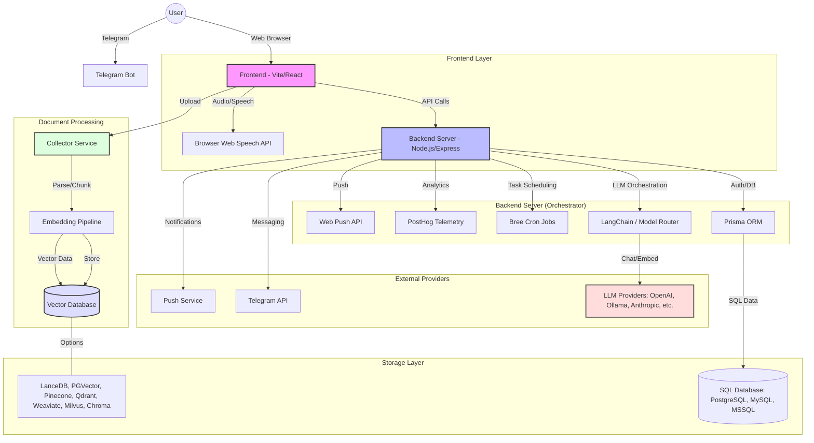

# System Architecture

This document describes the high-level architecture of the AnythingLLM ecosystem.

## Architecture Diagram

## Component Descriptions

### 1. User Interfaces
*   **Frontend (Vite/React)**: The primary web interface where users manage workspaces, view documents, and chat with AI. It handles real-time UI updates, multimedia (TTS/STT), and data visualization.
*   **Telegram Bot**: A secondary interface providing a mobile-friendly way to navigate the system, manage workspaces, and interact with the AI via messaging.

### 2. Backend Orchestrator
*   **Main Server (Node.js/Express)**: The central hub. It handles authentication, coordinates between the user and the AI models, manages the state of threads, and executes background tasks.
*   **LangChain**: Used to manage complex prompt chains, tool-use (agents), and diverse LLM provider integrations.
*   **Bree**: Handles scheduled recurring tasks like automated summaries or data syncing.

### 3. Data Processing Pipeline
*   **Collector**: A specialized service designed to ingest various file types (PDF, DOCX, etc.), parse their content, and prepare them for RAG.
*   **Embedding Pipeline**: Converts parsed text into numerical vectors using various embedding models.

### 4. Storage Layer
*   **SQL Database (PostgreSQL, MySQL, etc.)**: Stores persistent user data, workspace configurations, and thread history via Prisma.
*   **Vector Database**: Stores the embeddings for RAG, enabling the AI to retrieve relevant context from private documents.

### 5. External Integrations
*   **LLM Providers**: A variety of closed and open-source models that provide the "intelligence."
*   **PostHog**: Collects anonymous telemetry to help improve the product.
*   **Web Push**: Sends real-time notifications to users even when the browser tab is closed.
