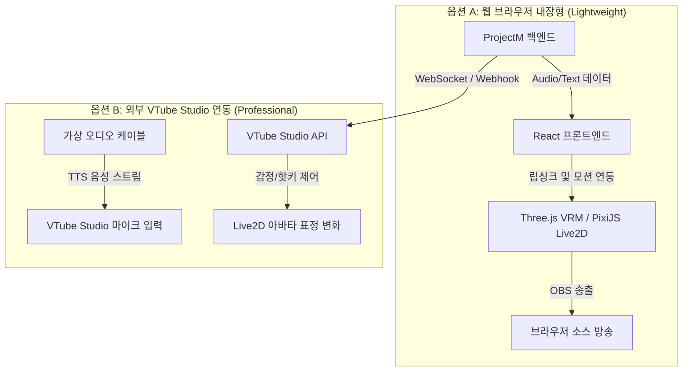

# 3D Avatar (VRM) 및 Live2D 방송 연동 통합 플랜

## 1. 개요 (Summary)
이 문서는 ProjectM(AnythingLLM) 플랫폼에 3D 아바타(VRM 포맷) 및 Live2D 캐릭터를 연동하여 가상 방송(버튜버/가상 스트리머) 또는 대화형 AI 동반자 시스템을 구축하기 위한 아키텍처 설계와 구현 계획을 기술합니다.

---

## 2. 배경 및 목적 (Context)
사용자는 AI와의 텍스트/음성 대화에서 나아가 실시간으로 입모양을 맞추고 표정을 짓는 3D/2D 아바타와 상호작용하기를 원합니다. 이를 통해 웹 대시보드 내에서 또는 OBS Studio 같은 방송 프로그램에 브라우저 소스로 임베딩하여 원클릭 버튜버 방송이 가능하도록 지원합니다.

---

## 3. 접근 방식 (Selected Approaches)

시스템 유연성과 난이도를 고려하여 두 가지 통합 경로를 제공합니다.

### [옵션 A] 웹 브라우저 내장형 렌더링 (Three.js VRM / PixiJS Live2D)
프론트엔드 웹 화면 내에서 실시간으로 아바타를 그리고 제어하는 무설치 플러그인 방식입니다.
*   **3D VRM**: `Three.js` 및 `@pixiv/three-vrm` 라이브러리를 사용하여 브라우저에서 VRM 3D 캐릭터 로딩 및 입 모양 변형(BlendShape) 제어.
*   **Live2D**: `PixiJS`와 `pixi-live2d-display`를 활용하여 2D 캐릭터 로드 및 입 열기 파라미터(`ParamMouthOpenY`) 매핑.
*   **립싱크**: 브라우저의 Web Audio API(`AudioContext`, `AnalyserNode`)로 TTS 오디오 볼륨 크기를 분석하여 실시간 입모양 크기에 동기화.

### [옵션 B] 외부 버튜버 앱 연동 (VTube Studio / Unity API)
PC 상에서 구동 중인 전문 아바타 추적 프로그램과 백엔드 간에 통신망을 결합하는 방식입니다.
*   **립싱크**: 백엔드 TTS 오디오 출력을 가상 오디오 디바이스(VB-Cable)로 보내고, VTube Studio가 이를 실시간 립싱크 입력으로 리스닝하도록 매핑.
*   **표정/감정 제어**: 백엔드 또는 에이전트 스킬에서 VTube Studio WebSocket API 프로토콜을 구현하여 AI 감정 라벨에 따라 핫키(Smile, Angry, Shock 등)를 자동 전송.

---

## 4. 아키텍처 및 상세 설계 (System Design)

### ① 백엔드 API 및 이벤트 추가
*   **감정 분석 미들웨어**: LLM의 응답 텍스트를 감정 분석(Sentiment Analysis: 긍정, 부정, 중립, 분노, 슬픔 등)하여 응답 메타데이터에 `emotion` 필드를 실시간 주입합니다.
*   **WebSocket 브로드캐스터**: `/api/avatar/stream` 웹소켓 엔드포인트를 개설하여 외부 3D 렌더러 또는 VTube Studio 연동 브리지 앱이 이벤트를 구독하도록 설계합니다.

### ② 프론트엔드 React 컴포넌트 추가
*   `frontend/src/components/AvatarViewer/` 디렉터리를 생성하여 VRM 모델과 Live2D 모델을 탭 형태로 선택하여 업로드하고 배치하는 뷰어를 추가합니다.
*   OBS Studio 송출용 배경 투명화 크로마키(Green Screen) 테마 모드를 지원합니다.

### ③ 에이전트 스킬 (Agent Skills)
*   아바타 특수 모션 작동용 도구 스킬 추가: `trigger_avatar_action({ actionName })`를 구현하여 AI가 대화 중 스스로 윙크를 하거나 인사를 할 수 있도록 동작 도구를 바인딩합니다.

---

## 5. 단계별 구현 계획 (Implementation Steps)

1.  **Phase 1: 백엔드 감정 추출기 구축**
    *   AI 답변 생성 시 감정(Emotion) 분석 모듈 연동 및 API 응답 스키마 확장.
2.  **Phase 2: 가상 오디오 케이블 가이드 및 VTube Studio 연동 브리지 개발**
    *   VTube Studio WebSocket API 통신 규격 구현.
3.  **Phase 3: React 프론트엔드용 내장형 3D/2D 아바타 렌더러 컴포넌트 개발**
    *   PixiJS 및 Three.js 의존성 추가 및 오디오 볼륨 립싱크 분석 코드 구현.
4.  **Phase 4: OBS 방송 연동 테스트 및 최적화**
    *   크로마키 배경 지원 및 OBS 브라우저 소스 렌더링 프레임 최적화.
