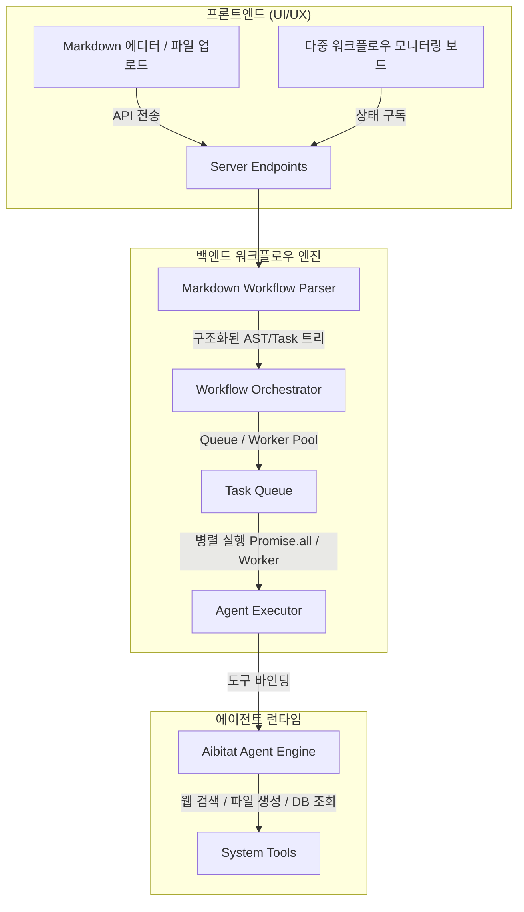

# Markdown 기반 에이전트 스킬 & 워크플로우 엔진 구축 플랜

## 1. 개요 (Summary)
이 문서는 ProjectM(AnythingLLM) 플랫폼 내에 비주얼 노드 방식(Agent Flows) 대신 마크다운(Markdown) 문서를 작성하여 에이전트 스킬과 워크플로우를 선언하고, 여러 워크플로우를 등록하여 동시에 병렬로 실행할 수 있는 **마크다운 기반 에이전트 워크플로우 엔진** 설계 및 구현 계획을 기술합니다.

---

## 2. 배경 및 목적 (Context)
* **낮은 사용성 극복**: 기존의 React Flow 기반 비주얼 노드 에디터는 다이어그램 연결 과정이 직관적이지 못하고 복잡한 워크플로우 구축 시 생산성이 떨어집니다.
* **표준성 및 생산성 향상**: 개발자 및 파워 유저들이 친숙한 Plain Text(Markdown + YAML Frontmatter) 형태로 에이전트 협업 절차를 작성하고 Git 등으로 형상 관리할 수 있도록 지원합니다.
* **다중/병렬 워크플로우 구동**: 대규모 배치 작업이나 다중 모니터링 시 여러 워크플로우가 대기 없이 동시에 동작(Concurrency)할 수 있도록 이벤트 루프 및 Worker Thread 기반의 병렬 실행력을 제공합니다.

---

## 3. 아키텍처 및 요구사항 (Key Architecture)



### ① 마크다운 워크플로우 스펙 규격
마크다운 파일 상단의 YAML Frontmatter를 통해 메타데이터와 동시성 설정을 정의하고, 본문에서는 순차적/병렬적 단계를 기입합니다.

```markdown
---
name: "다국어 시장 동향 조사"
description: "특정 주제를 구글 검색하여 요약하고 영어/일본어로 동시 번역합니다."
concurrency: "parallel"  # 기본 실행 모드 (parallel / sequential)
inputs:
  - name: "topic"
    type: "string"
    default: "AI Agent trend 2026"
outputs:
  - name: "report_path"
---

# 실행 절차

1. **Google Search** 스킬을 실행하여 `${topic}`에 대한 정보를 검색하고 텍스트로 합칩니다.
2. [Parallel] 아래 두 작업을 병렬로 수행합니다:
   * **Text Summary**: 검색 결과를 3문장으로 요약합니다.
   * **Keyword Extractor**: 검색 결과에서 주요 키워드 5개를 추출합니다.
3. [Parallel] 위 요약본을 가지고 다음 다국어 번역을 병렬로 진행합니다:
   * **Translation (EN)**: 요약본을 영어로 번역합니다.
   * **Translation (JP)**: 요약본을 일본어로 번역합니다.
4. 번역된 결과를 모아서 `storage/outputs/market_report_${topic}.md` 파일로 작성합니다.
```

---

## 4. 상세 설계 및 기능 (Detailed Design)

### ① Markdown Workflow Parser (`server/utils/agentFlows/markdownParser.js`)
* **Frontmatter 파싱**: `gray-matter` 라이브러리를 활용하여 상단의 YAML 영역에서 `inputs`, `outputs`, `concurrency` 설정을 추출합니다.
* **절차 분석 (AST 변환)**: 번호가 매겨진 리스트(`1.`, `2.`)를 순차 실행 노드로 인식하고, 리스트 내 하위 불릿 포인트 및 `[Parallel]` 마커를 통해 병렬 실행 블록을 식별하여 트리 형태로 분석(Abstract Syntax Tree)합니다.

### ② Workflow Orchestrator & Multi-Runner (`server/utils/agentFlows/markdownOrchestrator.js`)
* **동시 실행 지원**: 하나의 워크플로우 정의 파일(마크다운)로 여러 인스턴스(Job)를 동시 구동할 수 있습니다. 각 실행 인스턴스는 고유한 `runId`를 가집니다.
* **병렬 실행 제어**:
  * 마크다운 내 `[Parallel]` 그룹은 백엔드에서 `Promise.all()` 또는 태스크 큐에 스레드로 밀어 넣어 병렬로 실행합니다.
  * 여러 개 등록된 워크플로우 전체를 동시에 기동할 때는 비동기 백그라운드 워커(Bree.js 또는 Event Loop)로 분리되어 CPU 자원을 분할 점유하도록 스케줄링합니다.

### ③ Frontend UI 추가
* **워크플로우 관리자 패널**: 워크플로우 마크다운을 직접 텍스트로 편집하거나 업로드하여 저장할 수 있는 공간.
* **실시간 실행 대시보드**: 여러 워크플로우가 실시간으로 돌아갈 때, 각각 어떤 단계(`1. 검색 중`, `2. 번역 중[병렬]`)를 수행하고 있는지 상태 바(State progress)를 보여주는 실시간 로그 및 모니터링 뷰.

---

## 5. 단계별 구현 계획 (Implementation Steps)

1. **Phase 1: 마크다운 파서 및 AST 변환 엔진 구축**
   * `gray-matter`와 `marked` 파서를 커스텀하여 마크다운 절차 분석 로직 작성 및 단위 테스트.
2. **Phase 2: 비비동기 태스크 병렬 실행기(Orchestrator) 구현**
   * 단일 워크플로우 내의 `[Parallel]` 태스크 그룹을 병렬 처리하는 Executor 코딩.
   * 여러 개의 독립 워크플로우 파일을 동시 호출 시 이벤트 루프 충돌 없이 분리 가동되도록 큐 엔진 구축.
3. **Phase 3: 관리용 REST API 및 DB 모델 확장**
   * 마크다운 워크플로우 저장 및 이력(Run Logs) 관리를 위한 Prisma 스키마 추가.
4. **Phase 4: React 프론트엔드 모니터링 UI 및 편집 화면 연동**
   * 웹에디터 제공 및 워크플로우 실행 현황 실시간 WebSocket 스트리밍 모니터 대시보드 구축.
