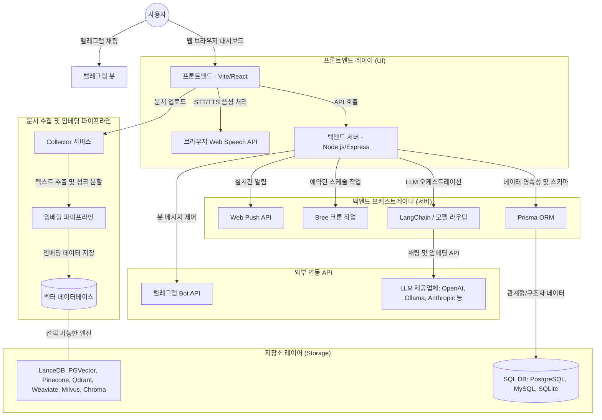

# 00. 개요 및 시스템 아키텍처

이 장에서는 ProjectM(AnythingLLM) 플랫폼의 기본 개념과 시스템 아키텍처에 대해 학습합니다.

---

## 1. ProjectM 소개
ProjectM은 기업 및 개인이 보유한 내부 문서(PDF, DOCX, TXT, Excel 등)를 바탕으로 AI와 안전하게 대화할 수 있도록 지원하는 **Retrieval-Augmented Generation (RAG)** 플랫폼입니다.

기존 LLM 모델이 학습하지 못한 전용 데이터를 검색하여 프롬프트에 동적으로 결합(Retrieval-Augment)함으로써 한계를 보완하고 정확한 대답을 유도합니다.

### 핵심 특징
*   **리소스 격리(Workspace)**: 다중 워크스페이스 구조를 지원하여 프로젝트 또는 사용자 그룹별로 완벽한 리소스 및 문서 보안 격리가 가능합니다.
*   **다양한 모델 제공업체 지원**: OpenAI, Anthropic, Google Gemini 등 상용 서비스뿐만 아니라 Ollama, LM Studio 등 로컬 모델 서버도 직접 연결할 수 있습니다.
*   **다양한 벡터 데이터베이스(Vector DB) 연동**: 가볍고 빠른 LanceDB부터 PGVector, Pinecone, Qdrant 등 엔터프라이즈 레벨의 다중 벡터 스토리지를 지원합니다.
*   **다중 인터페이스**: 일반적인 웹 브라우저 대시보드뿐 아니라 모바일에서도 간편히 대화와 관리가 가능한 텔레그램(Telegram) 챗봇을 부가 인터페이스로 지원합니다.

---

## 2. 시스템 아키텍처 다이어그램
ProjectM은 프론트엔드, 오케스트레이터 백엔드, 문서 처리 파이프라인, 데이터 저장소 및 다양한 외부 API가 유기적으로 상호작용하는 다층(Multi-tier) 시스템입니다.

---

## 3. 핵심 컴포넌트 상세

### ① 프론트엔드 (Vite + React)
*   **역할**: 관리자와 사용자를 위한 대시보드 및 채팅 인터페이스를 제공합니다.
*   **기능**: 워크스페이스 관리, 문서 업로드 UI, 수학 공식 렌더링(Katex), 코드 하이라이팅(highlight.js), 실시간 대화창, 통계/차트 뷰(Recharts, Tremor).

### ② 백엔드 오케스트레이터 (Node.js + Express)
*   **역할**: 시스템의 두뇌 역할을 담당하며 API 요청 라우팅, 인증, 비즈니스 로직 및 AI 응답 흐름을 조정합니다.
*   **LangChain**: 서로 다른 LLM 제공업체 모델 간의 호환 및 체인 실행, 에이전트 도구 호출을 관리합니다.
*   **Prisma ORM**: 사용자 정보, 대화 이력, 워크스페이스 설정 등을 관계형 데이터베이스에 매핑합니다.
*   **Bree**: 주기적인 백그라운드 자동 청소, 동기화 크론 잡을 스케줄링합니다.

### ③ 콜렉터 (Collector)
*   **역할**: 업로드된 문서 파일(PDF, Word, Excel, Text)에서 순수 텍스트를 추출하고, 임베딩에 적합한 길이로 텍스트를 조각내는(Chunking) 역할을 수행합니다.

### ④ 벡터 데이터베이스 (Vector DB)
*   **역할**: 텍스트 청크를 다차원 벡터 모델로 변환(Embedding)하여 저장한 뒤, 유저 질문과 유사도가 높은 조각을 고속으로 유사도 검색(Semantic Search)할 수 있도록 색인(Index)을 제공합니다.
