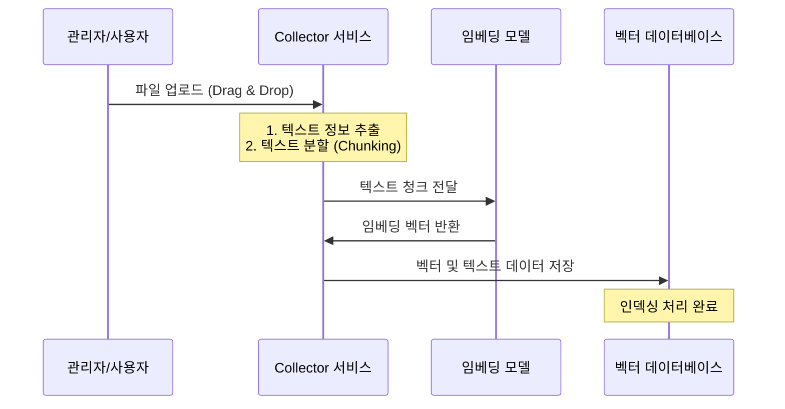

# 03. 워크스페이스 생성 및 문서 업로드 (RAG 구축)

이 장에서는 실제 RAG 질의응답 시스템의 근간이 되는 '워크스페이스(Workspace)'를 개설하고, 개인 문서를 처리하여 학습시키는 상세 단계를 가이드합니다.

---

## 1. 워크스페이스(Workspace) 개념 이해
워크스페이스는 문서, 대화 이력(Threads), 세팅, AI 에이전트 구성을 격리할 수 있는 독립적인 프로젝트 단위입니다.

예를 들어, **'인사팀 업무 가이드'** 워크스페이스와 **'개발팀 API 문서'** 워크스페이스를 각각 나누면 개발팀 문서가 인사팀과의 대화에 섞이지 않고 리소스 보안이 완벽하게 지켜집니다.

---

## 2. 새 워크스페이스 만들기
1.  대시보드 좌측 사이드바 상단의 **"+" (New Workspace)** 버튼을 클릭합니다.
2.  워크스페이스 이름(예: `My-RAG-Project`)을 입력합니다.
3.  **"Create Workspace"** 버튼을 눌러 개설을 마칩니다.

---

## 3. 문서 업로드 및 임베딩 파이프라인 (Document Ingestion)
사용자 컴퓨터에 있는 일반 문서(PDF, Word, Excel, TXT 등)를 AI가 참조할 수 있도록 전처리하는 과정입니다.

### 업로드 단계
1.  생성한 워크스페이스로 들어가 설정 영역 또는 대화창 상단의 **"Upload Document"** 버튼을 누릅니다.
2.  가지고 있는 문서 파일을 브라우저의 드래그 앤 드롭 영역에 끌어다 놓습니다.
3.  **"Upload & Ingest"** 버튼을 클릭하여 파이프라인을 구동합니다.
    *   *내부 처리*: 콜렉터 서비스가 텍스트를 파싱하고, 의미 있는 단위(Chunk Size 1000자 등)로 조각냅니다. 이후 설정된 임베딩 모델을 거쳐 숫자로 변환된 후 벡터 데이터베이스에 최종 색인됩니다.

---

## 4. 문서를 워크스페이스에 매핑하기 (Pinning)
업로드하여 임베딩된 문서는 시스템 전체 문서고에 보관되며, 이를 실제 대화에 반영하려면 해당 워크스페이스에 **'고정(Pinning)'** 해야 합니다.

1.  문서 목록(Workspace Documents) 관리 창을 엽니다.
2.  업로드 가공이 끝난 문서를 선택하여 우측 워크스페이스 영역으로 드래그하거나 체크박스를 선택합니다.
3.  **"Save & Sync"** 버튼을 눌러 동기화합니다.
4.  이제 해당 워크스페이스의 대화창에서 질문을 입력하면, AI가 고정된 문서를 실시간 검색하여 신뢰할 수 있는 대답을 생성합니다.
